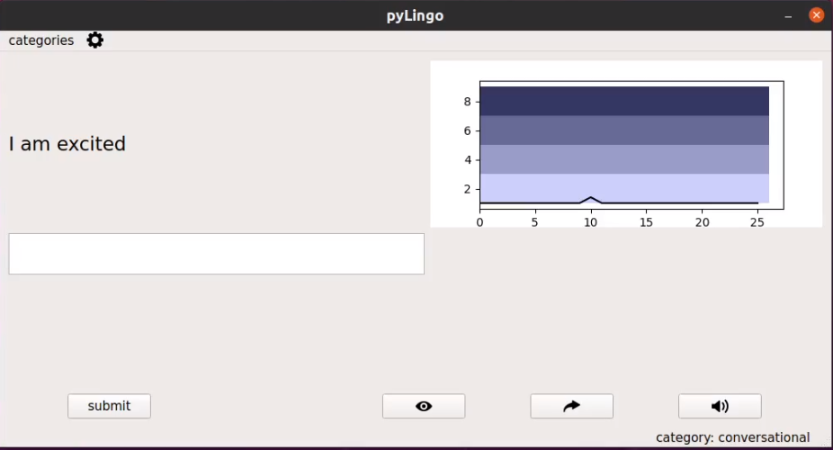
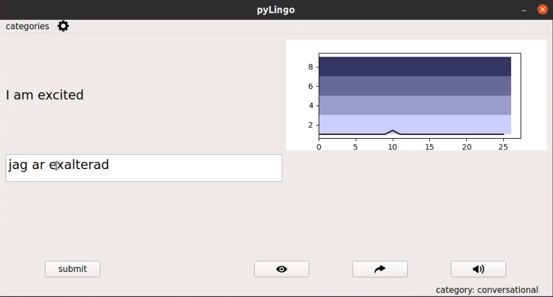
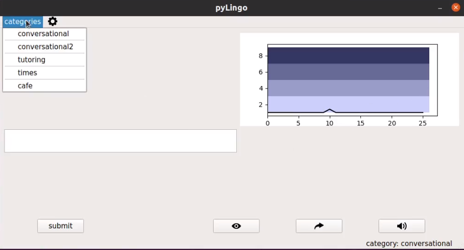
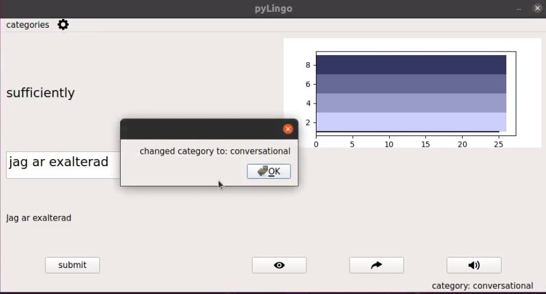
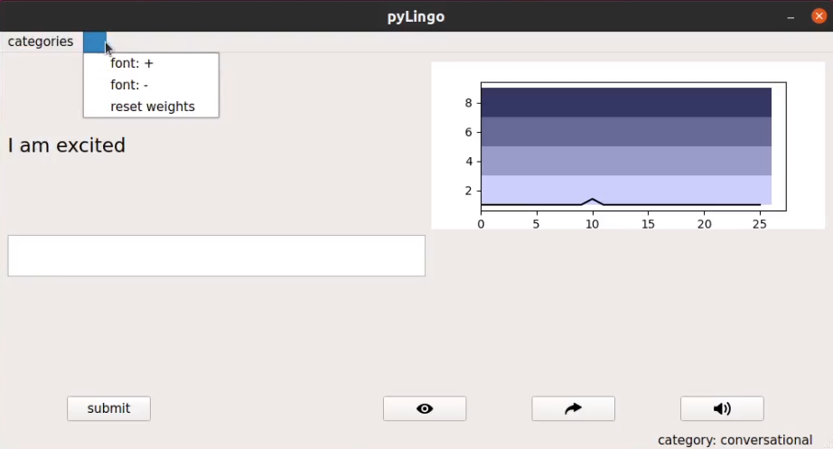
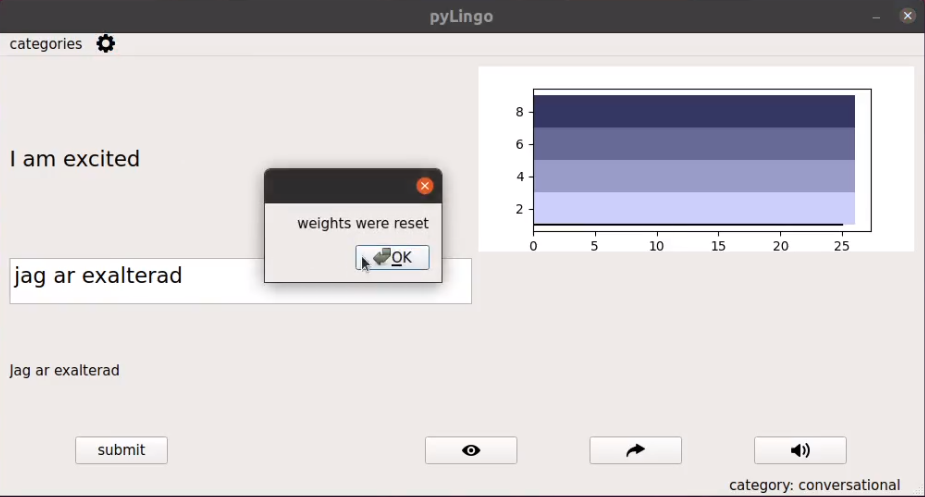
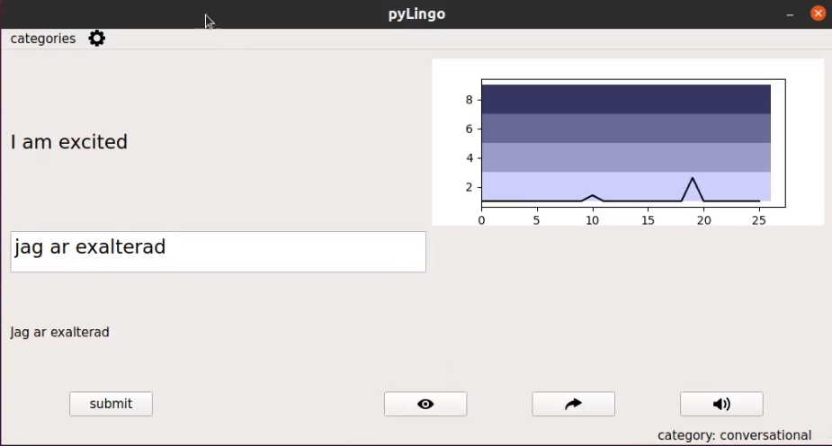

# pyLingo

pyLingo is a python-based graphical user interface to 
help a user learn phrases in a new language. The phrases to be practised 
can be defined by the user. 
---

### Running the app

---

run following in terminal to install python dependencies: 
```commandline
pip install -r requirements.txt
```

then run following in terminal to install pyqt5
```commandline
sudo apt-get install python3-pyqt5
```
then run tool in terminal:
```commandline
python gui.py
```
---
### Adding new phrases

Say you want to add a set of phrases for the new category "pets", you would do the following:
* Add the string "pets" to the phrase-categories list in config.json
* Add a folder called pets in the assets folder
* Add a phrases.json file to assets/pets
* Add an audio folder to assets/pets
* Fill the new phrases.json file with your new phrases, see already present phrases.json file for example
* Add mp3 audio files to the new audio folder, the filenames must be <number>.mp3
where <number> is consistent with the order the phrases are found in phrases.json, 
starting from 0, see files in already present audio folder for example.
---

### screenshots of user interface

## References

All symbol-based icons are resources from Flaticon.com
















